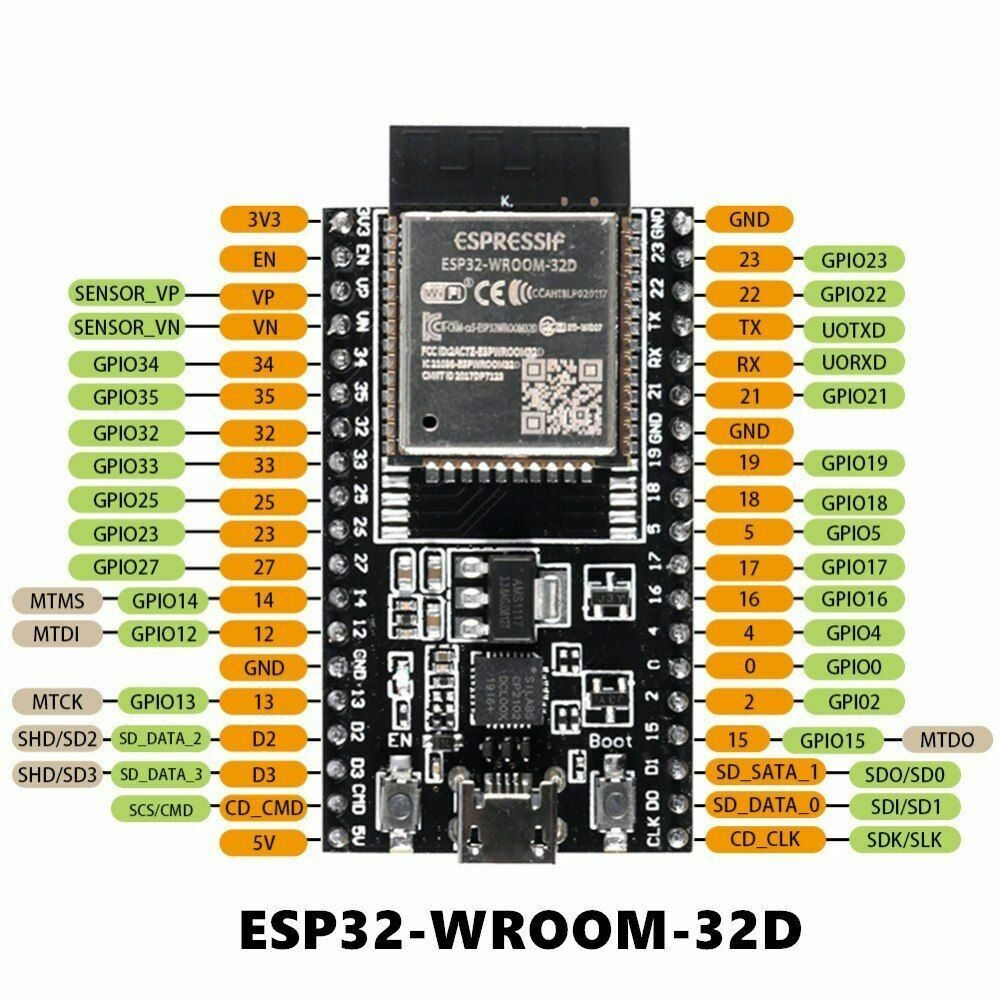
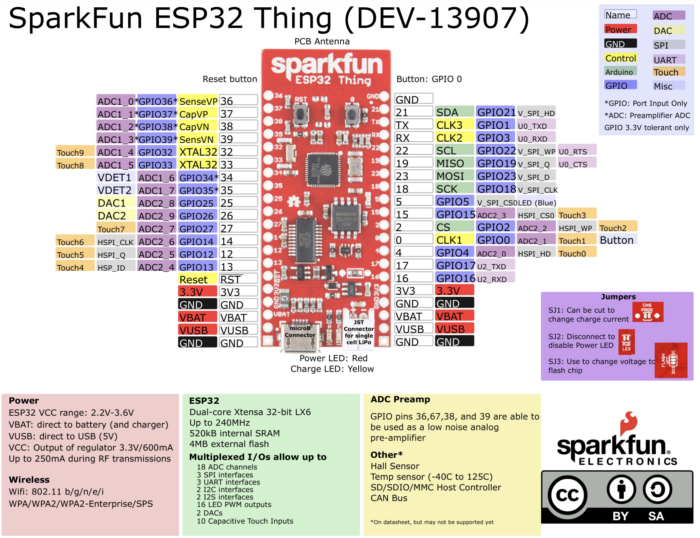
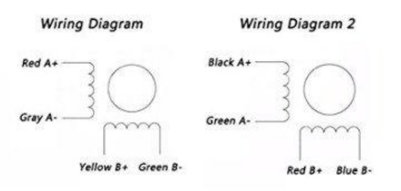

# Things

This repo is intended to hold the notes and code examples that I work through as I am learning how to program microcontrollers.

## Why?

My current goal is to learn how to program [ESP32](https://en.wikipedia.org/wiki/ESP32) based microcontrollers. I grow cut flowers, have a greenhouse and as a result I have several automation projects in mind, mostly involved with watering, climate control and tracking.  I also have a few project ideas for my computerized telescope to automate long imaging sessions. A secondary goal is to use a "real" programming language like C++ and Go for may projects.  I have looked at the Arduino IDE, which seems to be very popular, but I am not really interested.  Same for the visual programming tools that I have seen. 

## What?

This repo will have several subfolders each containing the source code and doc for some project. The first subfolder `proj01` is me working through a "hello world" project, which for microcontrollers is a blinking LED. The code is not that interesting but my notes will be from the point of view of a newbie and thus may contain things that were useful to me at the the time.

## Projects

* [proj01](proj01/README.md) - Hello World Blinky
* [proj02](proj02/README.md) - Serial port moniting with `picocom` CLI

## Components Reference

Below is an aggergate list of reference infomation used components use.

### ESP32-WROOM-32D

* [Product Page](https://www.espressif.com/en/products/modules)
* [Data Sheet](https://www.espressif.com/sites/default/files/documentation/esp32-wroom-32d_esp32-wroom-32u_datasheet_en.pdf)



### Sparkfun ESP32 Thing

* [Product Page](https://www.sparkfun.com/products/13907)
* [Data Sheet](https://cdn.sparkfun.com/assets/learn_tutorials/5/0/7/ESP32ThingV1a.pdf)



### M5Stickc Plus ESP32

* [Product Page](https://shop.m5stack.com/products/m5stickc-plus-esp32-pico-mini-iot-development-kit) development kit. 
* [Data Sheet](https://cdn.competec.ch/documents2/8/5/9/185624958/185624958.pdf)


### L298N Motor Driver

* [Data Sheet](http%3A%2F%2Fwww.handsontec.com%2Fdataspecs%2FL298N%20Motor%20Driver.pdf)


### Twotrees Nema17 Stepper Motor

* [Product Page](https://www.amazon.com/Twotrees-Nema-17-Stepper-Motor/dp/B07TGJSNJB?th=1)
* [Data Sheet](https://datasheetspdf.com/pdf/1328258/ETC/SM-17HS4023/1)


The pins on the motor, I think I have "Wiring Diagram 2"

pin1   | pin2 | pin3     | pin4    | pin5 | pin6
-------|------|----------|---------|------|---------
red B+ |      | black A+ | blue B- |      | green A-



This is high torque Nema 17 stepper motor with 1.8 deg.Each phase draws 1.5A,allowing for a holding torque 13Ncm(18.4oz.in)
40cm wire, one connect electrical machine, on the other end has variety optional ports.

It's ideal for the RepRap Prusa, Mendel 90, Rostock and， similar 3D printers, as well as CNC and robotics applications.
The motor is supplied with a 1 metre long power cable with a 4-pin Harwin female connector already fitted - ready to plug and print!

```text
Electrical Specification:
Product type:Bipolar 42 Stepper Motor
Step Angle: 1.8 deg. 
Rated Current/phase: 1.5A
Holding Torque:13Ncm(18.4oz.in)

General Specification:
Step angle accuracy: + - 5%(full step,not load)
Resistance accuracy: + - 10%
Inductance accuracy: + - 20%
Insulation resistance:100M Min,500VDC
Insultion Strength--------500VAC for one minute.

Package Included:
1 X Nema 17 Stepper Motors
1 X Cables
```

## Ideas for future projects

* [TryBotics](https://trybotics.com/project/tinygo-on-arduino-uno-an-introduction-6130f6) - has a good list of prjects
* [Astro Tracker](https://learn.adafruit.com/diy-robotic-sky-tracking-astrophotography-mount) - a DIY Robotic Sky Tracking Astrophotography Mount 

## Resources

* *Hands On Tec* - https://handsontec.com
