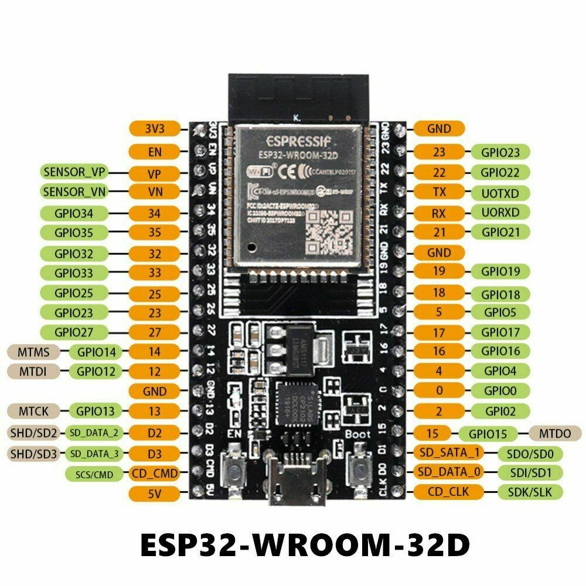
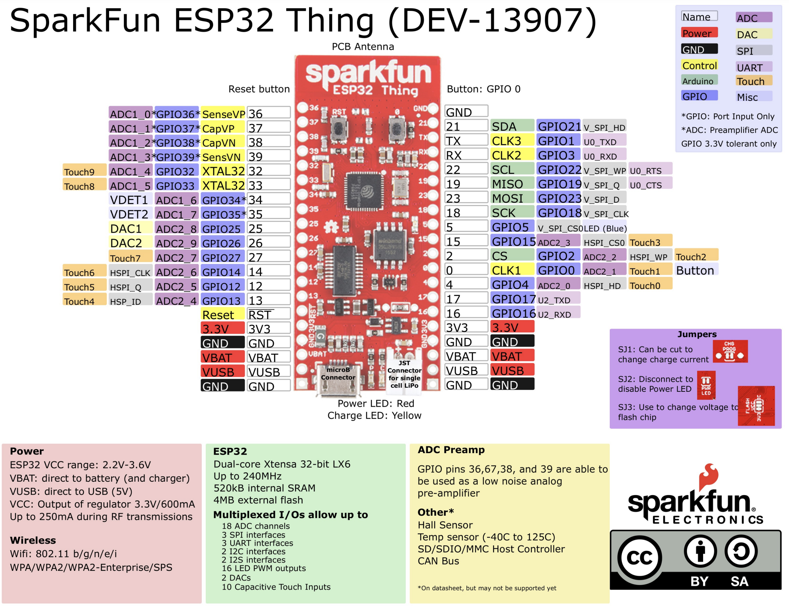
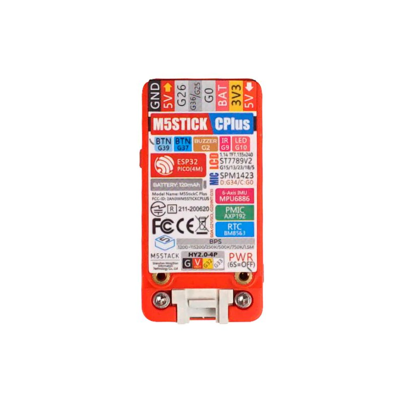
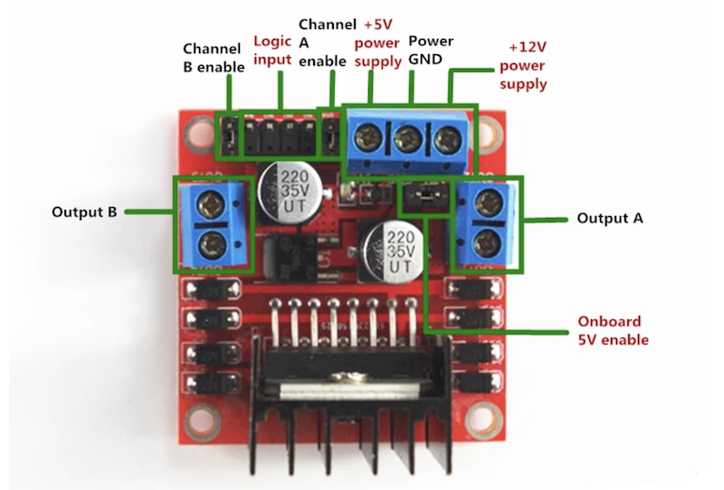
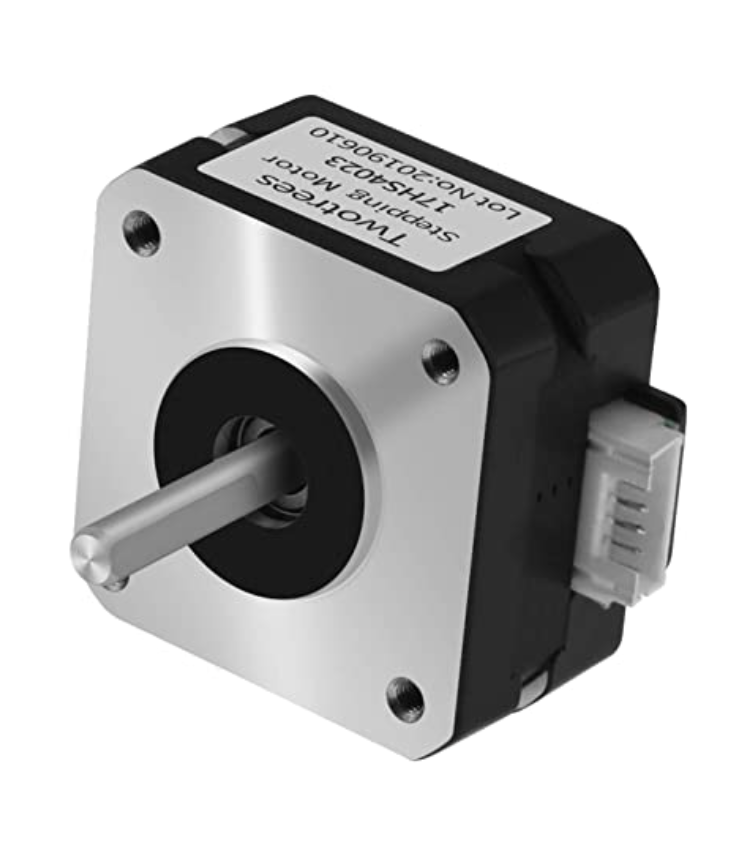
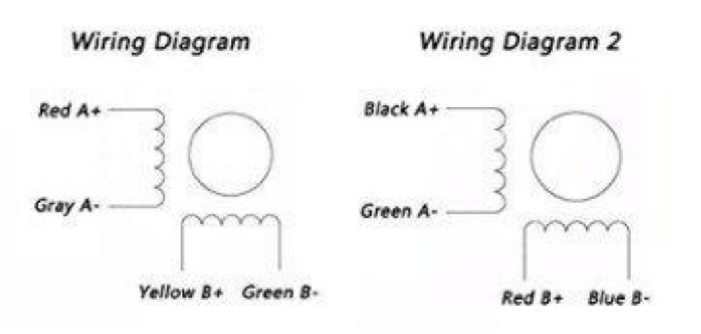
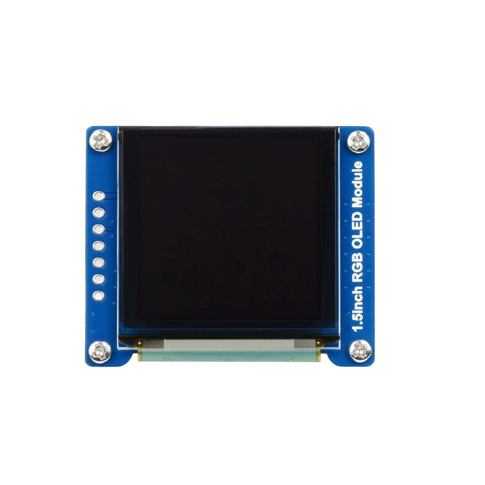
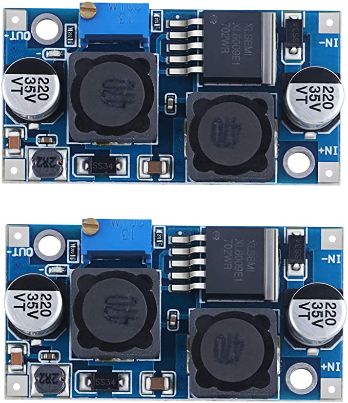
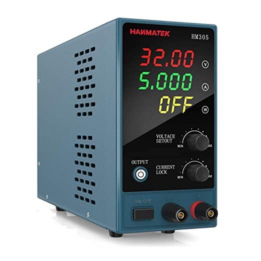

# Components Reference

Below is an aggergate list of reference infomation used components use.

---

## ESP32-WROOM-32D

* [Product Page](https://www.espressif.com/en/products/modules)
* [Data Sheet](https://www.espressif.com/sites/default/files/documentation/esp32-wroom-32d_esp32-wroom-32u_datasheet_en.pdf)



---

## Sparkfun ESP32 Thing

* [Product Page](https://www.sparkfun.com/products/13907)
* [Data Sheet](https://cdn.sparkfun.com/assets/learn_tutorials/5/0/7/ESP32ThingV1a.pdf)



---

## M5Stickc Plus ESP32

* [Product Page](https://shop.m5stack.com/products/m5stickc-plus-esp32-pico-mini-iot-development-kit) development kit. 
* [Data Sheet](https://cdn.competec.ch/documents2/8/5/9/185624958/185624958.pdf)



---

## L298N Motor Driver

* [Data Sheet](http%3A%2F%2Fwww.handsontec.com%2Fdataspecs%2FL298N%20Motor%20Driver.pdf)



---

## Twotrees Nema17 Stepper Motor

* [Product Page](https://www.amazon.com/Twotrees-Nema-17-Stepper-Motor/dp/B07TGJSNJB?th=1)
* [Data Sheet](https://datasheetspdf.com/pdf/1328258/ETC/SM-17HS4023/1)



The pins on the motor, I think I have "Wiring Diagram 2"

pin1   | pin2 | pin3     | pin4    | pin5 | pin6
-------|------|----------|---------|------|---------
red B+ |      | black A+ | blue B- |      | green A-



This is high torque Nema 17 stepper motor with 1.8 deg.Each phase draws 1.5A,allowing for a holding torque 13Ncm(18.4oz.in)
40cm wire, one connect electrical machine, on the other end has variety optional ports.

It's ideal for the RepRap Prusa, Mendel 90, Rostock and， similar 3D printers, as well as CNC and robotics applications.
The motor is supplied with a 1 metre long power cable with a 4-pin Harwin female connector already fitted - ready to plug and print!

```text
Electrical Specification:
Product type:Bipolar 42 Stepper Motor
Step Angle: 1.8 deg. 
Rated Current/phase: 1.5A
Holding Torque:13Ncm(18.4oz.in)

General Specification:
Step angle accuracy: + - 5%(full step,not load)
Resistance accuracy: + - 10%
Inductance accuracy: + - 20%
Insulation resistance:100M Min,500VDC
Insultion Strength--------500VAC for one minute.

Package Included:
1 X Nema 17 Stepper Motors
1 X Cables
```

---

## Orion Skyview Pro RA Drive Motor


This might be the [data sheet](http://www.motionking.com/Products/PM_Stepper_Motors/42PM_Stepper_Motor.htm) I am not sure:

Information for this motor and mount was hard to find but I believe the following to be true, although I could be wrong:

* drive motor period = 48 steps
* "tin can" gearbox attached to drive motor = 120:1
* motor w/tin can period = 48*120 = 5760 steps
* RA worm gear = 144:1
* RA period = 5760*144 = 829,440 steps
* drive motor wiring 
  * coil A - Green and Yellow
  * coil B - Red and Brown
  * 42PM48L(CZ) RoHS NO:20160720

---

## 1.5inch RGB OLED Display Module, 65K RGB Colors, 128×128, SPI

* [Product Page](https://www.waveshare.com/1.5inch-rgb-oled-module.htm)
* [Data Sheet](https://components101.com/sites/default/files/component_datasheet/XL6009-Datasheet_0.pdf)
* [How to use](https://components101.com/modules/xl6009-dc-dc-step-down-voltage-regulator-module)
* [dronebotworkshop Reference](https://dronebotworkshop.com/powering-your-projects/)




---

## Adjustable DC-DC Buck Boost Converter Automatic Wide Voltage Regulator XL6009 DC to DC 5-32 V to 1.25-35 V Voltage Module



* [Product Page](https://www.amazon.com/dp/B07NTXSJHB?psc=1&ref=ppx_yo2ov_dt_b_product_details)

---

## STEPPERONLINE 0.9deg Nema 17 Stepper Motor Bipolar 0.9A 36Ncm/50oz.in 42x42x39mm 4-wires DIY

17HM15-0904S
OSM 20161018


* [Product Page](https://www.amazon.com/dp/B00W98OYE4?psc=1&ref=ppx_yo2ov_dt_b_product_details)
* [Data sheet](https://m.media-amazon.com/images/I/91YX52MvwaL.pdf)

```text
This high precision bipolar Nema 17 stepper motor with 0.9° step angle (400 steps/revolution). Each phase draws current 0.9A, allowing for a holding torque of 36Ncm(50oz.in).

Electrical Specification

* Manufacturer Part Number: 17HM15-0904S
* Motor Type: Bipolar Stepper
* Step Angle: 0.9°
* Holding Torque: 36Ncm(50oz.in)
* Rated Current/phase: 0.9A
* Phase Resistance: 6.0ohms
* Recommended Voltage: 12-24V
* Inductance : 12.0mH±20%(1KHz)

Physical Specification

* Frame Size: 42 x 42mm
* Body Length: 40mm
* Shaft Diameter: Φ5mm
* Shaft Length: 22mm
* D-cut Length: 15mm
* Number of Leads: 4
* Lead Length: 300mm
* Weight : 280g
```

---

## Adjustable DC Power Supply (0-30 V 0-5 A) with Output Enable/Disable Button HANMATEK HM305 Mini Variable Switching Digital Bench Power Supply



* [product page](https://www.amazon.com/dp/B0852JZQZR?psc=1&ref=ppx_yo2ov_dt_b_product_details)

```txt
Product Specifications

* Color: 30V-5A
* Ean: 0745245800069
* Form Factor: Compact
* Model Number: HM305
* Part Number: dc-power
* Size: 30V5A
* Style: 30V5A
* UNSPSC Code: 43210000
* UPC: 745245800069
```
