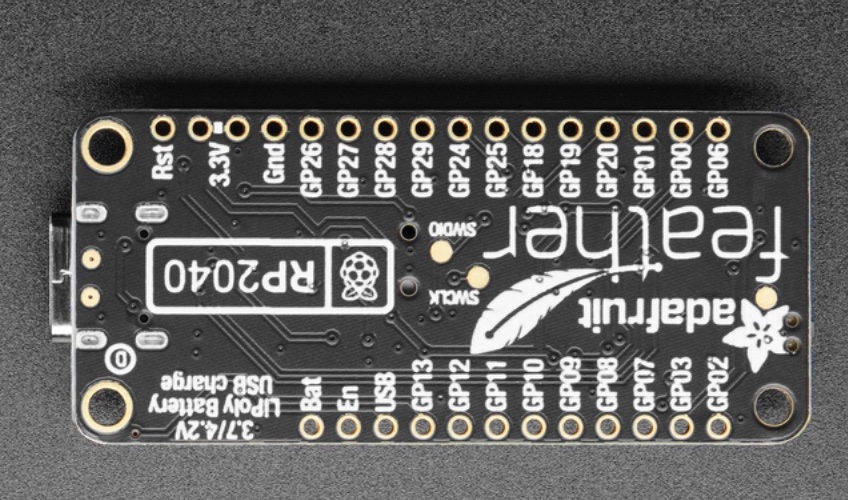

# Components Reference

Below is an aggergate list of reference infomation used components use.

---

## L298N Motor Driver

* [Data Sheet](http%3A%2F%2Fwww.handsontec.com%2Fdataspecs%2FL298N%20Motor%20Driver.pdf)


---

## Twotrees Nema17 Stepper Motor

* [Product Page](https://www.amazon.com/Twotrees-Nema-17-Stepper-Motor/dp/B07TGJSNJB?th=1)
* [Data Sheet](https://datasheetspdf.com/pdf/1328258/ETC/SM-17HS4023/1)


The pins on the motor, I think I have "Wiring Diagram 2"

| pin1   | pin2 | pin3     | pin4    | pin5 | pin6     |
| ------ | ---- | -------- | ------- | ---- | -------- |
| red B+ |      | black A+ | blue B- |      | green A- |


This is high torque Nema 17 stepper motor with 1.8 deg.Each phase draws 1.5A,allowing for a holding torque 13Ncm(18.4oz.in)
40cm wire, one connect electrical machine, on the other end has variety optional ports.

It's ideal for the RepRap Prusa, Mendel 90, Rostock and， similar 3D printers, as well as CNC and robotics applications.
The motor is supplied with a 1 metre long power cable with a 4-pin Harwin female connector already fitted - ready to plug and print!

```text
Electrical Specification:
Product type:Bipolar 42 Stepper Motor
Step Angle: 1.8 deg. 
Rated Current/phase: 1.5A
Holding Torque:13Ncm(18.4oz.in)

General Specification:
Step angle accuracy: + - 5%(full step,not load)
Resistance accuracy: + - 10%
Inductance accuracy: + - 20%
Insulation resistance:100M Min,500VDC
Insultion Strength--------500VAC for one minute.

Package Included:
1 X Nema 17 Stepper Motors
1 X Cables
```

---

## 1.5inch RGB OLED Display Module, 65K RGB Colors, 128×128, SPI

* [Product Page](https://www.waveshare.com/1.5inch-rgb-oled-module.htm)
* [Data Sheet](https://www.waveshare.com/w/upload/a/a7/SSD1351-Revision_1.5.pdf)
* [Wiki](https://www.waveshare.com/wiki/1.5inch_RGB_OLED_Module)


---

## Adjustable DC-DC Buck Boost Converter Automatic Wide Voltage Regulator XL6009 DC to DC 5-32 V to 1.25-35 V Voltage Module

* [Data Sheet](https://components101.com/sites/default/files/component_datasheet/XL6009-Datasheet_0.pdf)
* [How to use](https://components101.com/modules/xl6009-dc-dc-step-down-voltage-regulator-module)
* [dronebotworkshop Reference](https://dronebotworkshop.com/powering-your-projects/)


* [Product Page](https://www.amazon.com/dp/B07NTXSJHB?psc=1&ref=ppx_yo2ov_dt_b_product_details)

---

## STEPPERONLINE 0.9deg Nema 17 Stepper Motor Bipolar 0.9A 36Ncm/50oz.in 42x42x39mm 4-wires DIY

17HM15-0904S
OSM 20161018


* [Product Page](https://www.amazon.com/dp/B00W98OYE4?psc=1&ref=ppx_yo2ov_dt_b_product_details)
* [Data sheet](https://m.media-amazon.com/images/I/91YX52MvwaL.pdf)

```text
This high precision bipolar Nema 17 stepper motor with 0.9° step angle (400 steps/revolution). Each phase draws current 0.9A, allowing for a holding torque of 36Ncm(50oz.in).

Electrical Specification

* Manufacturer Part Number: 17HM15-0904S
* Motor Type: Bipolar Stepper
* Step Angle: 0.9°
* Holding Torque: 36Ncm(50oz.in)
* Rated Current/phase: 0.9A
* Phase Resistance: 6.0ohms
* Recommended Voltage: 12-24V
* Inductance : 12.0mH±20%(1KHz)

Physical Specification

* Frame Size: 42 x 42mm
* Body Length: 40mm
* Shaft Diameter: Φ5mm
* Shaft Length: 22mm
* D-cut Length: 15mm
* Number of Leads: 4
* Lead Length: 300mm
* Weight : 280g
```

---

## Adjustable DC Power Supply (0-30 V 0-5 A) with Output Enable/Disable Button HANMATEK HM305 Mini Variable Switching Digital Bench Power Supply


* [product page](https://www.amazon.com/dp/B0852JZQZR?psc=1&ref=ppx_yo2ov_dt_b_product_details)

```txt
Product Specifications

* Color: 30V-5A
* Ean: 0745245800069
* Form Factor: Compact
* Model Number: HM305
* Part Number: dc-power
* Size: 30V5A
* Style: 30V5A
* UNSPSC Code: 43210000
* UPC: 745245800069
```

---

Letgo A4988 Stepstick Stepper Motor Driver Module with Heat Sink


>Note, Pin-1 lower right `GND`, Pin-16 lower left `DIR`

* product page - [pololu](https://www.pololu.com/product/1182) | [amazon](https://www.amazon.com/dp/B07BND65C8?psc=1&ref=ppx_yo2ov_dt_b_product_details)
* Data sheet - [pololu](https://www.pololu.com/file/0J450/A4988.pdf)

Product Description:

* Size: 1.5mmX2mm (for RAMPS, ultimaker or other compatible boards);
* The drive current: 2A (best to install the heat sink)
* Segments: 1,1 / 2,1 / 4,1 / 8,1 / 16
* Manufacturing process: higher SMT placement machine manufacturing, non-manual welding, yield, more stable performance.

Reference:

* Dronebot Workshop - [Blog](https://dronebotworkshop.com/stepper-motors-with-arduino/) | [Youtube](https://www.youtube.com/watch?v=0qwrnUeSpYQ)

---

## USB to TTL Serial Cable - Debug / Console Cable for Raspberry Pi


* product page - [adafruit](https://www.adafruit.com/product/954)
* If you are running Mac OS X, check [this tutorial page](https://learn.adafruit.com/adafruits-raspberry-pi-lesson-5-using-a-console-cable/software-installation-mac) with links to drivers for both PL2303 and CP2012

Pins:

* Black: GND
* White: UART0 TX (pin 1 - GP0 - on the Pico)
* Green: UART0 RX (pin 2 - GP1 - on the Pico)

## CUI Devices - AMT223B-V


* [Product Page CUI](https://www.cuidevices.com/product/motion/rotary-encoders/absolute/modular/amt22-v-kit/amt223b-v)
* [Product Page Mouser](https://www.mouser.com/ProductDetail/CUI-Devices/AMT223B-V?qs=l7cgNqFNU1jjpjuNzTFAxw%3D%3D)
* [Datasheet CUI](https://www.cuidevices.com/product/resource/amt22-v.pdf)
* [CUI Resource Page](https://www.cuidevices.com/resources/resource-library?categories=motion&tags=All&itemsPerPage=9999)

Operation

The AMT22 encoder operates in two modes: programming, and **SPI mode**. To enter programming mode for use with
AMT Viewpoint™ the slide on the bottom of the encoder must be moved to the programming position. Slide the switch
to the left position before connecting encoder to AMT Viewpoint™. Once configuration in AMT Viewpoint™ is completed,
disconnect encoder and return switch to the standard run mode position before connecting encoder to system. Switch must
be in proper mode for programming or SPI before power is connected to device.


See also [AMT22 Arduino SPI Sample Code Tutorial](https://www.cuidevices.com/product/resource/sample-code/amt22)


> (this needs confirmed) While looking at the front the #1 pin is on the left.

## AMT-PGRM-06C


* [Product Page CUI](https://www.cuidevices.com/product/motion/rotary-encoders/encoder-accessories/amt-cables/amt-pgrm-06c)
* [Product Page Mouser](https://www.mouser.com/ProductDetail/CUI-Devices/AMT-PGRM-06C?qs=XeJtXLiO41RU2%252BvAgDDHyA%3D%3D)
* [Datasheet CUI](https://www.cuidevices.com/product/resource/amt-pgrm.pdf)

## 2inch LCD Display Module For Raspberry Pi Pico, 65K RGB Colors, 320×240 Pixels, SPI Interface


* [Product Page Waveshare](https://www.waveshare.com/pico-lcd-2.htm)

## TMC2208 Motor Driver


* [Datasheet](https://www.trinamic.com/fileadmin/assets/Products/ICs_Documents/TMC220x_TMC2224_datasheet_Rev1.09.pdf)

## ST-Link V2

ST-Link-Compatible Programmer & Emulator / Debugging dongle


* [product page](https://www.adafruit.com/product/2548)

## Adafruit VL53L1X Time of Flight Distance Sensor - ~30 to 4000mm - STEMMA QT / Qwiic

The Adafruit VL53L1X Time of Flight Distance Sensor (also known as VL53L1CX) is a Time of Flight distance sensor that has a massive 4 meter range and LIDAR-like precision.


References

* [product page](https://www.adafruit.com/product/3967)
* [pin outs](https://learn.adafruit.com/adafruit-vl53l1x/pinouts)
* [learn](https://learn.adafruit.com/adafruit-vl53l1x)

For the STEMMA QT cables, we follow the Qwiic convention ([ref](https://learn.adafruit.com/introducing-adafruit-stemma-qt/technical-specs)):

1. Black for GND
2. Red for V+
3. Blue for SDA
4. Yellow for SCL

Details

* Emitter: 940 nm invisible laser (Class1)
* SPAD (single photon avalanche diode) receiving array with integrated lens
* FlightSense™ ranging sensor for fast and accurate long distance ranging
* Up to 400 cm distance measurement
* Up to 50 Hz ranging frequency
* Typical full field-of-view (FoV): 27 °
* Programmable region-of-interest (ROI) size on the receiving array, allowing the sensor FoV to be reduced
* Programmable ROI position on the receiving array, providing multizone operation control from the host
* Can be hidden behind many cover window materials
* I²C interface (up to 400 kHz)
* Shutdown and interrupt pins
* Default I2C address 0x29 (can be changed in software by using shutdown pin to disable other sensors on the same bus)

## Adafruit Universal USB / DC / Solar Lithium Ion/Polymer charger - bq24074


>There is no 'Done' LED - when the CHG LED turns off, thats how you know charging is complete

This charger is the only one you need to keep all your Lithium Polymer (LiPoly) or Lithium Ion (LiIon) rechargeable batteries topped up.

* [product page](https://www.adafruit.com/product/4755)
* [learn](https://learn.adafruit.com/adafruit-bq24074-universal-usb-dc-solar-charger-breakout)

## Pico Display Pack


* [product page](https://shop.pimoroni.com/products/pico-display-pack)

Details

* Driver: ST7789
* 1.14” 240x135 pixel IPS LCD screen

## Adafruit Triple-axis Magnetometer - MMC5603 - STEMMA QT / Qwiic


> see Tinygo LIS2MDL driver

* [product page](https://adafru.it/5579)
* [learn page](https://learn.adafruit.com/adafruit-mmc5603-triple-axis-magnetometer)

## Adafruit Feather RP2040




* [product page](https://www.adafruit.com/product/4884)

## Adafruit Triple-axis Magnetometer - LIS2MDL - STEMMA QT / Qwiic


* [product page](https://www.adafruit.com/product/4488)
* [tinygo driver - LIS2MDL](https://github.com/tinygo-org/drivers/tree/release/lis2mdl)
