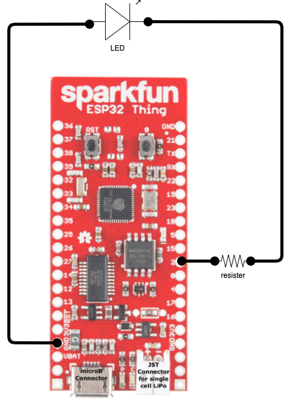

# Example 01

This example is to create a "hello world" LED blink program.

## Getting started

To get started we need to install a few tings:

* Go
* TinyGo
* VSCode
* TinyGo VSCode Plugin
* vcp-drivers

### Install Go

Follow the [Go Install Guide](https://go.dev/doc/install). Note, currently 4/11/2022, Go v1.18 is available but you will need to install v1.17. TinyGo does not yet support Go v1.18.  

### Install TinyGo

Following the [TinyGo Install Guid](https://tinygo.org/getting-started/install/). The install guide describes a few *Additional Requirements* that I don't believe I need but I installed the Arduino Uno tool because, well, I don't know I am new I don't know what I am doing.  If you have a simular setup as I do, I would not install the additional tools unless you find you actually need them. 

## Install VS Code

If you are like me you already have VS Code but if not you can go [here](https://code.visualstudio.com/download) to install it.

## Install the TinyGo VSCode Plugin

This plugin adds minimal but important functionality to VS Code.  You can click the extensions icon in VS Code and search for "TinyGo" or go [here](https://marketplace.visualstudio.com/items?itemName=tinygo.vscode-tinygo) and click the install button.

### Install VCP Drivers

I *think* VCP drivers are needed so you can use a USB cable to hookup up your board to your Mac. I was floundering a bit at first so I am not 100% on this but I think you need to install the [USB to UART Bridge VPC Drivers](https://www.silabs.com/developers/usb-to-uart-bridge-vcp-drivers) from Silicon Labs.

On my mac the board shows up as `/dev/cu.usbserial-D30DOR8N` if you have a Mac it should show up as `/dev/cu.something`.  I hope that helps.

## Now for the fun, Blinkey!

At this point we have enough software installed let's see if we can build something.

For this project we are going to use the only board I have and that is the [Sparkfun ESP32 Thing](https://www.sparkfun.com/products/13907) a.k.a. the "Thing". I have a [M5 Stick](https://docs.m5stack.com/en/core/m5stickc_plus) on order but that is for a future post. 

TinyGo is new and does not yet support the Thing. But I was able to select the **esp32-coreboard-v2** board and get the GPIO pin to work.  I was not able to monitor the serial output, something I hope to fix in the future.

Here are the steps I use to create the blinky program found in the `example01` folder:

* Create a project folder
  ```sh
  mkdir example01
  cd example01
  go mod init blinky
  ```

* In VS Code bring up the command pallet `cmd+shift+p` on a Mac and type `TinyGo target` then select `esp32-coreboard-v2`, this is not the correct board but it works and my exact board is not listed.
* Create `example01/main.go` source file and make it look like [this](main.go).
  ```go
  package main

  import (
    "machine"
    "time"
  )

  func main() {

    var pin machine.Pin = 2
    pin.Configure(machine.PinConfig{Mode: machine.PinOutput})

    for {

      pin.Low()
      time.Sleep(time.Millisecond * 1000)

      pin.High()
      time.Sleep(time.Millisecond * 1000)
    }
  }
  ```

* Connect the board to your Mac via USB and flash it:
  ```sh
  tinygo flash -target=esp32-coreboard-v2
  ```
  The full output looks like this:
  ```sh
  esptool.py v3.3
  Serial port /dev/cu.usbserial-D30DOR8N
  Connecting..............
  Chip is ESP32-D0WDQ6-V3 (revision 3)
  Features: WiFi, BT, Dual Core, 240MHz, VRef calibration in efuse, Coding Scheme None
  Crystal is 26MHz
  MAC: 30:c6:f7:18:ae:84
  Uploading stub...
  Running stub...
  Stub running...
  Configuring flash size...
  Flash will be erased from 0x00001000 to 0x00001fff...
  Flash params set to 0x031f
  Compressed 3120 bytes to 2361...
  Wrote 3120 bytes (2361 compressed) at 0x00001000 in 0.3 seconds (effective 86.6 kbit/s)...
  Hash of data verified.
  ```

> **IMPORTANT**: You must hold the `0` button down during the flashing process.  This button is built into the board in the upper right near the `TX` pin. This is annoying but maybe it is a security thing but I will be looking for a way to avoid this in the future.

* Wire up the project like this
  


* Click the `RST` on the board to restart the program.


TODO add video
