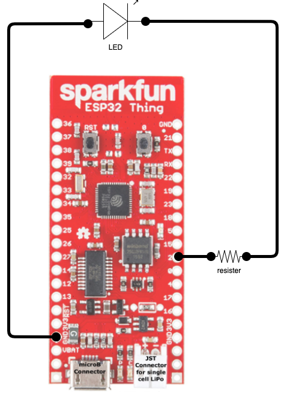

# Blinky

In this video I will show how to use TinyGo to program an ESP32 dev board.

We will create a simple "hello world" program that will make an LED blink.

The program it's self is not that interesting but I will show you how to do it with TinyGo and VSCode. 

## Required Software

* Go
* TinyGo
* VSCode
* TinyGo VSCode Extension

> I will include links for install instructions in the video description

## Getting Started

Verify setup:

* **GO** - `go version`
* **TinyGo** - `tinygo version`
* **TinyGo Extenstion** -  *Shift+Command+X* and search for `TinyGo`
* **Select Board** - *Shift+Command+P* and search for `TinyGo Target`

## The Circuit

Let's review the circuit:



## Demo

```sh
# Run flash while holding down the 0-button 
tinygo flash -target=esp32-coreboard-v2

```
