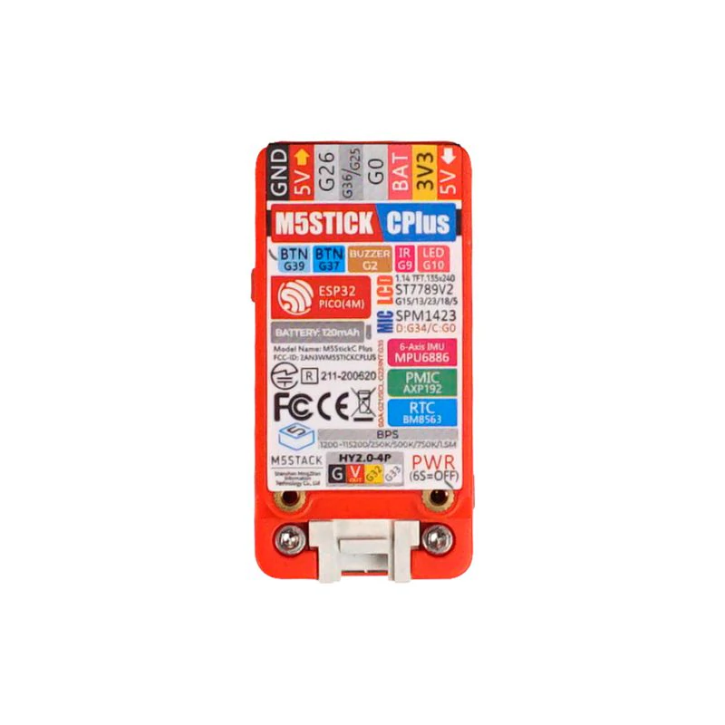

# Microcontroller Reference

My MCU reference

* [ESP32 Pin Reference](https://randomnerdtutorials.com/esp32-pinout-reference-gpios/)

---

## Raspberry Pi - Pico MCU

* [product page](https://www.raspberrypi.com/products/raspberry-pi-pico/)
* [data sheet pico](https://datasheets.raspberrypi.com/pico/pico-datasheet.pdf)
* [data sheet rp2040](https://datasheets.raspberrypi.org/rp2040/rp2040-datasheet.pdf)

Product Desecription:

* 21 mm × 51 mm form factor
* RP2040 microcontroller chip designed by Raspberry Pi in the UK
* Dual-core Arm Cortex-M0+ processor, flexible clock running up to 133 MHz
* 264kB on-chip SRAM
* 2MB on-board QSPI flash
* 2.4GHz 802.11n wireless LAN (Raspberry Pi Pico W and WH only)
* 26 multifunction GPIO pins, including 3 analogue inputs
* 2 × UART, 2 × SPI controllers, 2 × I2C controllers, 16 × PWM channels
* 1 × USB 1.1 controller and PHY, with host and device support
* 8 × Programmable I/O (PIO) state machines for custom peripheral support
* Supported input power 1.8–5.5V DC
* Operating temperature -20°C to +85°C (Raspberry Pi Pico and Pico H); -20°C to +70°C (Raspberry Pi Pico W and Pico WH)
* Castellated module allows soldering direct to carrier boards (Raspberry Pi Pico and Pico W only)
* Drag-and-drop programming using mass storage over USB
* Low-power sleep and dormant modes
* Accurate on-chip clock
* Temperature sensor
* Accelerated integer and floating-point libraries on-chip

## Adafruit Feather RP2040

* [product page](https://www.adafruit.com/product/4884)

## ESP32-WROOM-32D

* [Product Page](https://www.espressif.com/en/products/modules)
* [Data Sheet](https://www.espressif.com/sites/default/files/documentation/esp32-wroom-32d_esp32-wroom-32u_datasheet_en.pdf)

---

## Sparkfun ESP32 Thing

* [Product Page](https://www.sparkfun.com/products/13907)
* [Data Sheet](https://cdn.sparkfun.com/assets/learn_tutorials/5/0/7/ESP32ThingV1a.pdf)

---

## M5Stickc Plus ESP32

* [Product Page](https://shop.m5stack.com/products/m5stickc-plus-esp32-pico-mini-iot-development-kit) development kit.
* [Data Sheet](https://cdn.competec.ch/documents2/8/5/9/185624958/185624958.pdf)

## LoRa-E5 Dev Kit

| Parameters          | Specifications                                                     |
| ------------------- | ------------------------------------------------------------------ |
| Size                | Wio-E5 Dev Board: 85.6*54mm  Package: 200*130*50mm                 |
| Voltage - supply    | 3-5V (Battery) / 5V(USB Type C)                                    |
| Voltage - output    | EN 3V3 / 5V                                                        |
| Power - output      | Up to +20.8dBm at 3.3V                                             |
| Frequency           | EU868 / US915 / AU915 / AS923 / KR920 / IN865                      |
| Protocol            | Long Range                                                         |
| Sensitivity         | -116.5dBm ~ -136dBm                                                |
| interfaces          | USB Type C / JST2.0 / Grove*3(IIC*2/UART*1) / RS485 / SMA-K / IPEX |
| modulation          | Long Range , (G)FSK, (G)MSK, BPSK                                  |
| working temperature | -40℃ ~ 85℃                                                         |
| current             | Wio-E5 module sleep current as low as 2.1uA (WOR mode)             |

* [Product Page](https://www.seeedstudio.com/LoRa-E5-Dev-Kit-p-4868.html)
* [Data Sheet](https://files.seeedstudio.com/products/317990687/res/STM32WLE5JC%20Datasheet.pdf)
* [Dev Board wiki](https://wiki.seeedstudio.com/LoRa_E5_Dev_Board/)
* [Wio-E5 STM32WLE5JC Module wiki](https://wiki.seeedstudio.com/LoRa-E5_STM32WLE5JC_Module/)

>See [proj13-lora1](./proj13-lora1/README.md) for instructions on how to program the Lora-E5

## LoRa-E5 Mini (STM32WLE5JC)

* [Product Page (Seeed Studios)](https://www.seeedstudio.com/LoRa-E5-mini-STM32WLE5JC-p-4869.html?queryID=8bf68a34326ec4e8e6cba7b80073476b&objectID=4869&indexName=bazaar_retailer_products)
* [Product Page (digikey)](https://www.digikey.com/en/products/detail/seeed-technology-co-ltd/113990939/13926228?s=N4IgTCBcDaIDIHkBKBBAtAUQKwAICyAkgHIE4gC6AvkA)
* [Data Sheet](https://files.seeedstudio.com/products/317990687/res/LoRa-E5%20module%20datasheet_V1.0.pdf)

