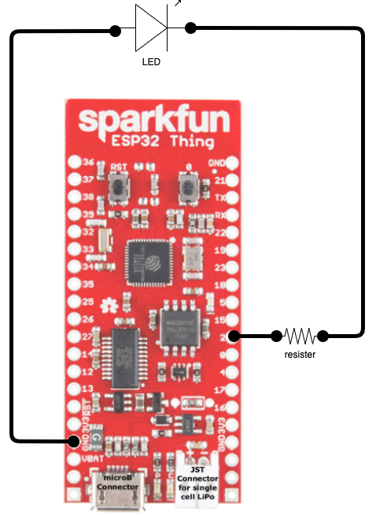

# Project 01 - Hello World LED Blink on Sparkfun ESP32 Thing

In this project I will create a "hello world" LED blink program.

## Getting started

To get started we need to install some tools:

* **Go** - Follow the [Go Install Guide](https://go.dev/doc/install). 
  >Note, as of the time of this writing, Go v1.18 is available but you will need to install v1.17. TinyGo does not yet support Go v1.18 yet.

* **TinyGo** - Following the [TinyGo Install Guid](https://tinygo.org/getting-started/install/).

* **VS Code** - You can download and install VS Code from [here](https://code.visualstudio.com/).

* **TinyGo VSCode Extension** - Click the extensions icon in VS Code and search for "TinyGo" or go [here](https://marketplace.visualstudio.com/items?itemName=tinygo.vscode-tinygo) and click the install button.

* **VCP Drivers** - The VCP drivers are needed to connect your board to your Mac via USB cable. I am not 100% on this but I think you need to install the [USB to UART Bridge VPC Drivers](https://www.silabs.com/developers/usb-to-uart-bridge-vcp-drivers) from Silicon Labs.
* **picocom** - This CLI is optional but useful for monitoring your serial port, `brew install picoc`

On my Mac the board shows up as `/dev/cu.usbserial-D30DOR8N` if you have a Mac it should show up as `/dev/cu.something`.  I hope that helps.

## Now for the fun, Blinkey!

At this point we have enough software installed let's see if we can build something.

For this project we are going to use the only board I have and that is the [Sparkfun ESP32 Thing](https://www.sparkfun.com/products/13907) a.k.a. the "Thing". I have a [M5 Stick](https://docs.m5stack.com/en/core/m5stickc_plus) on order but that is for a future post. 

TinyGo is new and does not yet support the Thing. But I was able to select the **esp32-coreboard-v2** board and get the GPIO pin to work.  I was not able to monitor the serial output, something I hope to fix in the future.

Here are the steps I use to create the blinky program found in the `project01` folder:

1. Create a project folder

    ```sh
    mkdir proj01
    cd proj01
    go mod init blinky
    ```

1. In VS Code bring up the command pallet `cmd+shift+p` on a Mac and type `TinyGo target` then select `esp32-coreboard-v2` or find your board if you see it listed.
1. Create `project01/main.go` source file and make it look like [this](main.go).

    ```go
    package main

    import (
      "machine"
      "time"
    )

    func main() {

      var pin machine.Pin = 2
      pin.Configure(machine.PinConfig{Mode: machine.PinOutput})

      for {

        pin.Low()
        time.Sleep(time.Millisecond * 500)

        pin.High()
        time.Sleep(time.Millisecond * 500)
      }
    }
    ```

1. Connect the board to your Mac via USB and flash it:
  
    ```sh
    tinygo flash -target=esp32-coreboard-v2
    ```

    The full output looks like this:

    ```sh
    esptool.py v3.3
    Serial port /dev/cu.usbserial-D30DOR8N
    Connecting..............
    Chip is ESP32-D0WDQ6-V3 (revision 3)
    Features: WiFi, BT, Dual Core, 240MHz, VRef calibration in efuse, Coding Scheme None
    Crystal is 26MHz
    MAC: 30:c6:f7:18:ae:84
    Uploading stub...
    Running stub...
    Stub running...
    Configuring flash size...
    Flash will be erased from 0x00001000 to 0x00001fff...
    Flash params set to 0x031f
    Compressed 3120 bytes to 2361...
    Wrote 3120 bytes (2361 compressed) at 0x00001000 in 0.3 seconds (effective 86.6 kbit/s)...
    Hash of data verified.

    #
    # Other useful command
    #

    # To monitor the serial port
    picocom --baud 115200 /dev/cu.usbserial-D30DOR8N

    # Flash the chip
    esptool.py --chip=esp32 erase_flash
    ```

    > **IMPORTANT**: You must hold the `0` button down during the flashing process.  This button is built into the board in the upper right near the `TX` pin.

1. The circuit is shown in the drawing below. Click the `RST` on the board to restart the program.
  


## See it in action

See the demo on [YouTube](https://www.youtube.com/watch?v=3h1Oa36aLyA)

## References

* [SparkFun ESP32 Thing (DEV-13907) Visual Data Sheet](https://cdn.sparkfun.com/assets/learn_tutorials/5/0/7/ESP32ThingV1a.pdf)
* [TinyGo: Good Things Come in Small Packages](https://auth0.com/blog/tinygo-good-things-come-in-small-packages/?utm_source=content_synd&utm_medium=sc&utm_campaign=golang) - Liam Hampton
* [TinyGo's GitHub Page](https://github.com/tinygo-org/tinygo)
* [TinyGo's Website](https://tinygo.org/)
* [TinyGo an introduction](https://trybotics.com/project/tinygo-on-arduino-uno-an-introduction-6130f6) - trybotics.com, good video of several sample projects
* [TinyGo Driver Examples](https://pkg.go.dev/tinygo.org/x/drivers/examples) - pkg.go.dev
* [TinyGo's examples in src/examples](https://github.com/tinygo-org/tinygo/tree/release/src/examples)
* [using screen CLI to monitor the serial port](https://learn.sparkfun.com/tutorials/terminal-basics/command-line-windows-mac-linux#:~:text=You%20can%20now%20use%20the,now%20connected%20to%20that%20port!) - To disconnect, type **control-a** then **shift-k**.
* [Honey I shrunk the Gophers!](https://www.youtube.com/watch?v=2v91Rff4Ipk&list=PL9DQRFSnwAyM7Ti02BUS1FEFNQV_dQGjJ&index=4) on YouTube -- Donia Chaiehloudj and her [TinyGo Discovery GitHub Page](https://github.com/doniacld/tinygo-discovery)
* [Weather Hub](https://github.com/ardnew/weatherhub) - Andrew, Uses ESP32 wifi
* [TynyGo Drivers](https://github.com/tinygo-org/drivers)
* [TynyGo Driver Examples](https://github.com/tinygo-org/drivers/tree/release/examples)
* [Aykevl's Examples on GitHub](https://github.com/aykevl/things)
