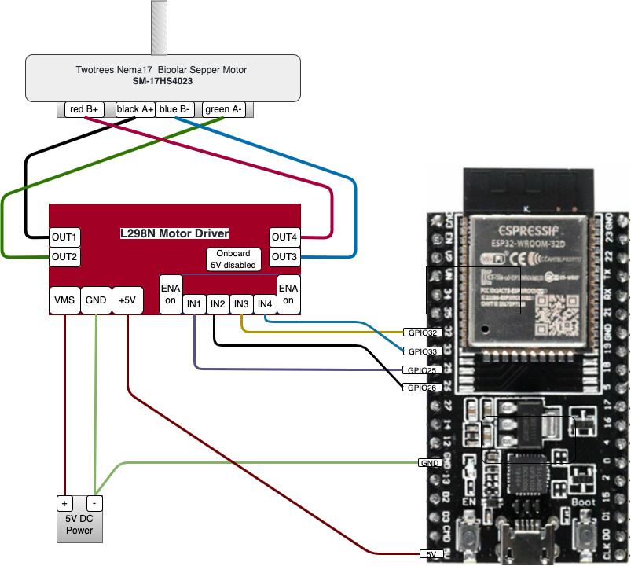

# proj03 - Bipolar Stepper Motor

In this project we will demonstrate how to drive a Bipolar Stepper Motor using TinyGo. Here are the project components.

Components used:

* **TinyGo** - A Go compiler for small places, see [tinygo.org](https://tinygo.org/)
* **ESP32-WROOM-32D** - [Data Sheet](https://www.espressif.com/sites/default/files/documentation/esp32-wroom-32d_esp32-wroom-32u_datasheet_en.pdf)
* **L298N Motor Driver** - [Data Sheet](http%3A%2F%2Fwww.handsontec.com%2Fdataspecs%2FL298N%20Motor%20Driver.pdf)
* **Twotrees Nema17 Stepper Motor** - [Data Sheet](https://datasheetspdf.com/pdf/1328258/ETC/SM-17HS4023/1)
* **easystepper** - a tinygo package, [reference](https://pkg.go.dev/tinygo.org/x/drivers/easystepper)

> See also my [component reference](https://github.com/tonygilkerson/things#components)

## Project Demo

In this demo we are going to move the "hand" on a stepper motor as follows:

* Start at the 12 o'clock positin
* Move to 3 o'clock and back
* Move to 6 o'clock and back
* Move to 9 o'clock and back

Move               | Rotations  | Steps      |
:-----------------:|:----------:|:----------:|
to 3 o'clock       | 1/4        |  50 (200/4)
back to 12 o'clock | 1/4        |  50 (200/4)
to 6 o'clock       | 1/2        | 100 (200/2)
back to 12 o'clock | 1/2        | 100 (200/2)
to 9 o'clock       | 3/4        | 150 (200*3/4)
back to 12 o'clock | 3/4        | 150 (200*3/4)
|| Total Steps | 600

The motor does 200 steps per rotation, therefore if we will set the `rpm` setting to 3 rpm to make the total expected time **1 minute**

>

```bash
tinygo flash -target=esp32-coreboard-v2  -port=/dev/cu.usbserial-0001
picocom --baud 115200 /dev/cu.usbserial-0001
```

## References

* The code on GitHub ([github.com](https://github.com/tonygilkerson/things/tree/main/proj03))

* My Component Reference on GitHub ([github.com](https://github.com/tonygilkerson/things#components))

* DroneBot Workshop channel is great
  * Stepper Motors with Arduino - Controlling Bipolar & Unipolar stepper motors ([www.youtube.com](https://www.youtube.com/watch?v=0qwrnUeSpYQ), [Article](https://dronebotworkshop.com/stepper-motors-with-arduino/))
