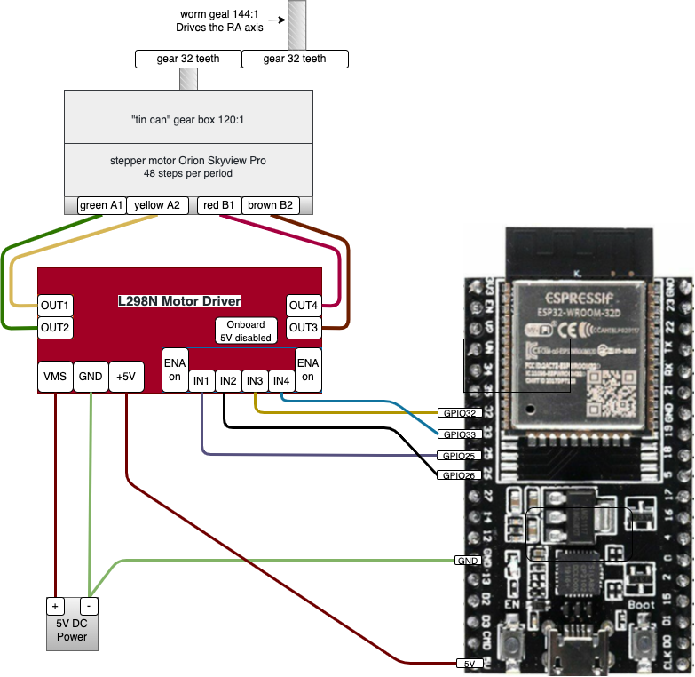

# proj04 - Proto Astro Stepper

In this project I we will create the very beginnings of a stepper package that can control an Astronomy Telescope

Components used:

* **TinyGo** - A Go compiler for small places, see [tinygo.org](https://tinygo.org/)
* **ESP32-WROOM-32D** - [Data Sheet](https://www.espressif.com/sites/default/files/documentation/esp32-wroom-32d_esp32-wroom-32u_datasheet_en.pdf)
* **L298N Motor Driver** - [Data Sheet](http%3A%2F%2Fwww.handsontec.com%2Fdataspecs%2FL298N%20Motor%20Driver.pdf)
* **Twotrees Nema17 Stepper Motor** - [Data Sheet](https://datasheetspdf.com/pdf/1328258/ETC/SM-17HS4023/1)
* **astrostepper** - this module is my initial modifications to tinygo's *easystepper*  package, [reference](https://pkg.go.dev/tinygo.org/x/drivers/easystepper)
* **Orion SkyView RA Stepper Motor** - The original guide motor on the old Orion Skyview Pro telescope. See "Orion Skyview Pro RA Drive Motor" on my [component reference](https://github.com/tonygilkerson/things#orion-skyview-pro-ra-drive-motor) for more detail.

> See also my [component reference](https://github.com/tonygilkerson/things#components)

## Project Demo



```bash
tinygo flash -target=esp32-coreboard-v2  -port=/dev/cu.usbserial-0001
picocom --baud 115200 /dev/cu.usbserial-0001
```


## References

DEVTODO - cleanup this section

https://onstep.groups.io/g/main/wiki/4414
https://instein.eu/index.php?route=product/category&path=25
https://www.youtube.com/watch?v=FKAPvcvGb-s

Mount Gearbox Ratio Calculator
http://www.astrofriend.eu/astronomy/astronomy-calculations/mount-gearbox-ratio/mount-gearbox-ratio.html

EasyDriver A3967 Stepper Motor Driver Tutorial
https://www.youtube.com/watch?v=nafoHAhz8Ys
This is a way to do microstepping also, you can enable/disable the moter via logic board to allow for manual adjustment of the mount, very interesting (not sure if I would need that if I got everything thing else working but it is an interesting option.)


