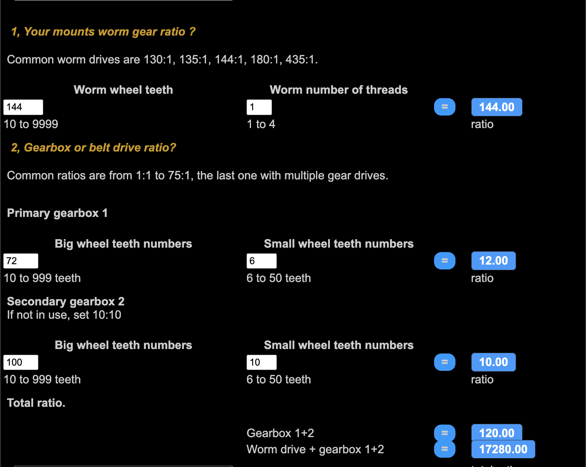
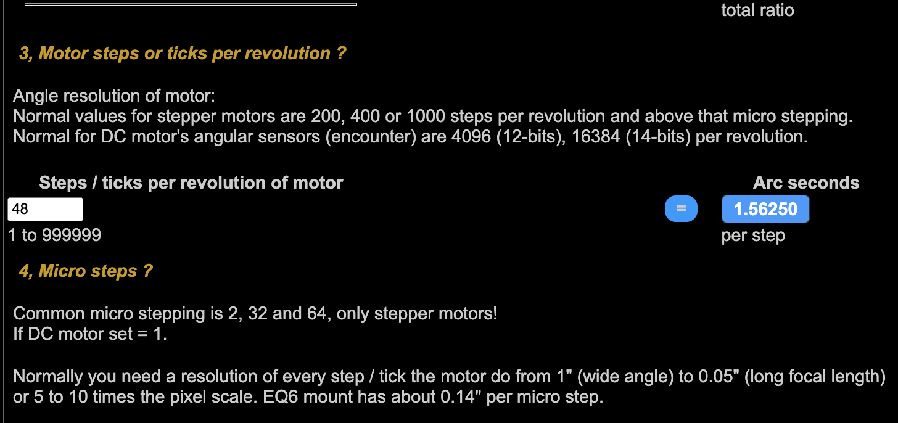

# proj04 - Proto Astro Stepper

In this project I we will create the very beginnings of a stepper package that can control an Astronomy Telescope

Components used:

* **TinyGo** - A Go compiler for small places, see [tinygo.org](https://tinygo.org/)
* **ESP32-WROOM-32D** - [Data Sheet](https://www.espressif.com/sites/default/files/documentation/esp32-wroom-32d_esp32-wroom-32u_datasheet_en.pdf)
* **L298N Motor Driver** - [Data Sheet](http%3A%2F%2Fwww.handsontec.com%2Fdataspecs%2FL298N%20Motor%20Driver.pdf)
* **Twotrees Nema17 Stepper Motor** - [Data Sheet](https://datasheetspdf.com/pdf/1328258/ETC/SM-17HS4023/1)
* **astrostepper** - this module is my initial modifications to tinygo's *easystepper*  package, [reference](https://pkg.go.dev/tinygo.org/x/drivers/easystepper)
* **Orion SkyView RA Stepper Motor** - The original guide motor on the old Orion Skyview Pro telescope. See "Orion Skyview Pro RA Drive Motor" on my [component reference](https://github.com/tonygilkerson/things#orion-skyview-pro-ra-drive-motor) for more detail.

> See also my [component reference](https://github.com/tonygilkerson/things#components)

## Project Demo


```bash
tinygo flash -target=esp32-coreboard-v2  -port=/dev/cu.usbserial-0001
picocom --baud 115200 /dev/cu.usbserial-0001
```

## Mount and Motor Specs

During the making of this demo I did my best to determine the basic specifications of the motor and my mount gears. I believe the following to be true, although I could be wrong:

* drive motor period = `48` steps ([data sheet?](http://www.motionking.com/Products/PM_Stepper_Motors/42PM_Stepper_Motor.htm))
* "tin can" gearbox attached to drive motor = 120:1
* motor w/tin can period = 48*120 = 5760 steps
* RA worm gear = 144:1
* RA period = 5760*144 = 829,440 steps
* drive motor wiring 
  * coil A - Green and Yellow
  * coil B - Red and Brown
  * 42PM48L(CZ) RoHS NO:20160720

Mount Gearbox Ratio Calculator ([www.astrofriend.eu](http://www.astrofriend.eu/astronomy/astronomy-calculations/mount-gearbox-ratio/mount-gearbox-ratio.html))


> **Note** - I don't know what is inside the "tin can" gearbox but I do believe the combined ratio is `120:1`, therefore, I fabricated numbers for the primary and secondary gears to achieve the correct ratio.
> 
> **Key Takaway** - Angle resolution of motor: `1.56250` Arc Seconds

## References

* My Component Reference on GitHub ([github.com](https://github.com/tonygilkerson/things#components))
* Mount Gearbox Ratio Calculator ([www.astrofriend.eu](http://www.astrofriend.eu/astronomy/astronomy-calculations/mount-gearbox-ratio/mount-gearbox-ratio.html))
* OnStep
  * OnStep product page ([https://instein.eu](https://instein.eu/index.php?route=product/category&path=25))
  * This page showcases what users have built with OnStep ([https://onstep.groups.io](https://onstep.groups.io/g/main/wiki/4414))
  * OnStep Telescope Making EQ5 ([www.youtube.com](https://www.youtube.com/watch?v=FKAPvcvGb-s))
