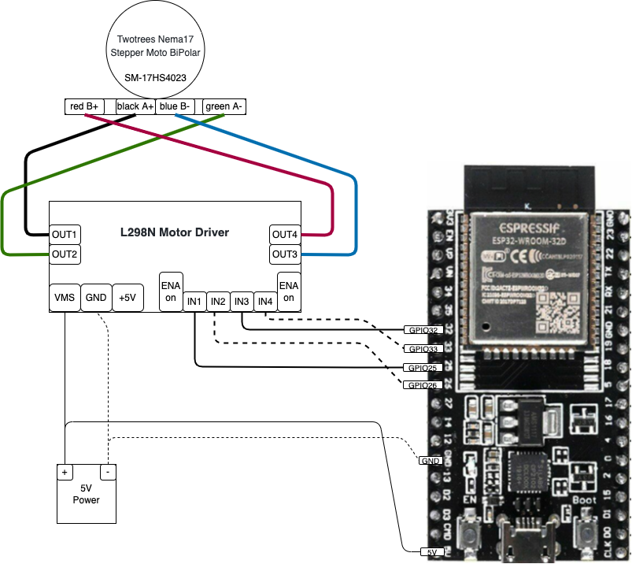

# Project 05 - Bipolar Stepper Motor

In this project we will demonstrate how to drive a Bipolar Stepper Motor with TinyGo. Here are the project components.

* **TinyGo** - A Go compiler for small places, see [tinygo.org](https://tinygo.org/)
* **L298N Motor Driver** - [Data Sheet](http%3A%2F%2Fwww.handsontec.com%2Fdataspecs%2FL298N%20Motor%20Driver.pdf)

A work in progress

## L298N Reference

http://www.handsontec.com/dataspecs/L298N%20Motor%20Driver.pdf


## Project Demo



```bash
tinygo flash -target=esp32-coreboard-v2  -port=/dev/cu.usbserial-0001
picocom --baud 115200 /dev/cu.usbserial-0001
```