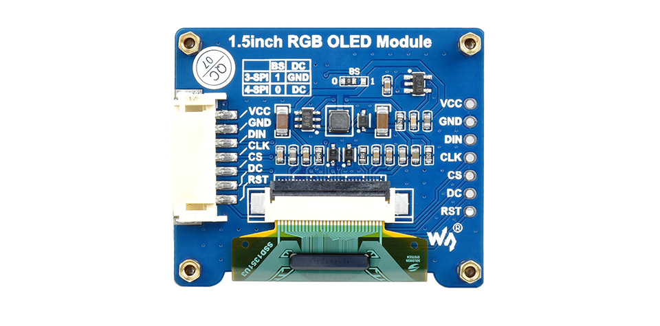
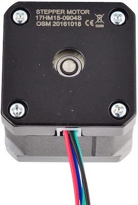
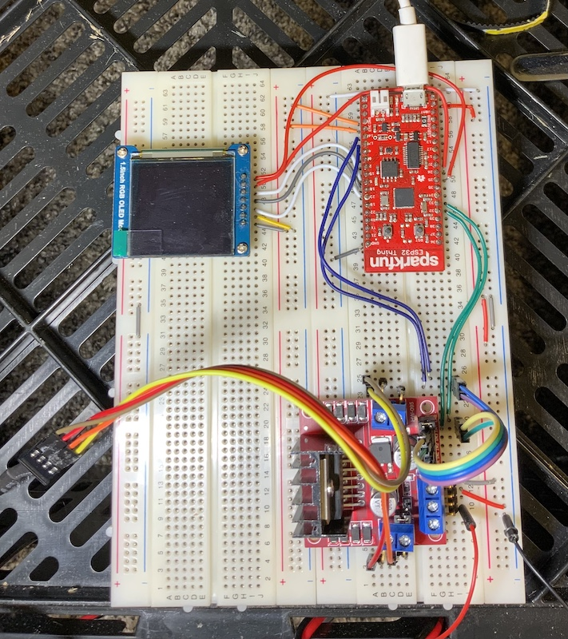

# proj07 - Astrostepper with OLED

In this project I am combining the astrostepper and OLED projectes into one.

## Components Used

The following are the components used in this project

---

## Sparkfun ESP32 Thing

* [Product Page](https://www.sparkfun.com/products/13907)
* [Data Sheet](https://cdn.sparkfun.com/assets/learn_tutorials/5/0/7/ESP32ThingV1a.pdf)


## L298N Motor Driver

* [Data Sheet](http%3A%2F%2Fwww.handsontec.com%2Fdataspecs%2FL298N%20Motor%20Driver.pdf)


---

## 1.5inch RGB OLED Display Module, 65K RGB Colors, 128×128, SPI

* [Product Page](https://www.waveshare.com/1.5inch-rgb-oled-module.htm)
* [Data Sheet](https://components101.com/sites/default/files/component_datasheet/XL6009-Datasheet_0.pdf)
* [How to use](https://components101.com/modules/xl6009-dc-dc-step-down-voltage-regulator-module)
* [dronebotworkshop Reference](https://dronebotworkshop.com/powering-your-projects/)




---

## STEPPERONLINE 0.9deg Nema 17 Stepper Motor Bipolar 0.9A 36Ncm/50oz.in 42x42x39mm 4-wires DIY

17HM15-0904S
OSM 20161018



* [Product Page](https://www.amazon.com/dp/B00W98OYE4?psc=1&ref=ppx_yo2ov_dt_b_product_details)
* [Data sheet](https://m.media-amazon.com/images/I/91YX52MvwaL.pdf)

```text
This high precision bipolar Nema 17 stepper motor with 0.9° step angle (400 steps/revolution). Each phase draws current 0.9A, allowing for a holding torque of 36Ncm(50oz.in).

Electrical Specification

* Manufacturer Part Number: 17HM15-0904S
* Motor Type: Bipolar Stepper
* Step Angle: 0.9°
* Holding Torque: 36Ncm(50oz.in)
* Rated Current/phase: 0.9A
* Phase Resistance: 6.0ohms
* Recommended Voltage: 12-24V
* Inductance : 12.0mH±20%(1KHz)

Physical Specification

* Frame Size: 42 x 42mm
* Body Length: 40mm
* Shaft Diameter: Φ5mm
* Shaft Length: 22mm
* D-cut Length: 15mm
* Number of Leads: 4
* Lead Length: 300mm
* Weight : 280g
```

> See also my [component reference](https://github.com/tonygilkerson/things#components)

## Project Results

* Display motor status on OLED display
* Started `astrodisplay` package
* Replaced old motor with a new one, I got lucky was able to attach to astro mount with minimal fabercation
* Used pullys and belt to drive the worm gear
* I did not implement microstepping yet
* See KiCad for wireing detail

DEVTODO - Update KiCad to match actual wireing

> **FAIL** -  The motor driver pauses when the OLED display is updated. See this
[TinyGo Slack Thread](https://gophers.slack.com/archives/CDJD3SUP6/p1656303867086829) on the topic.  
>
> **TL;DR** While the ESP32 has two cores, we [TinyGo] currently only use one of them

The suggestion is to use a PWM channel to drive the motor so as to not interupt the main CPU loop.

## Project Pics





## Notes

```bash
tinygo flash -target=esp32-coreboard-v2  -port=/dev/cu.usbserial-0001
picocom --baud 115200 /dev/cu.usbserial-0001
```

## References

* GT2 12T 5mm bore 6mm belt pulley (DEC motor shaft)
* GT2 12T 5mm bore 6mm belt pulley (RA motor shaft)
  * [product page](https://www.amazon.com/gp/product/B01IMPM44O/ref=ox_sc_act_title_1?smid=A12MRQC2NA7LMA&psc=1) - Qunqi 5packs Aluminum GT2 Timing Belt Pulley 16 Teeth Bore 5mm Width 6mm

* GT2 48T 6mm bore 6mm belt pulley (The other attached to worm drive )
  * [product page](https://www.amazon.com/gp/product/B07SR78PKY/ref=ox_sc_act_title_1?smid=A1NQCH9MN8OPZG&th=1) - 2GT 48T Timing Pulley 6mm Bore 6mm Belt Width For CNC 3D Printer Reprap (Tooth Width：7mm, Bore：6mm)
