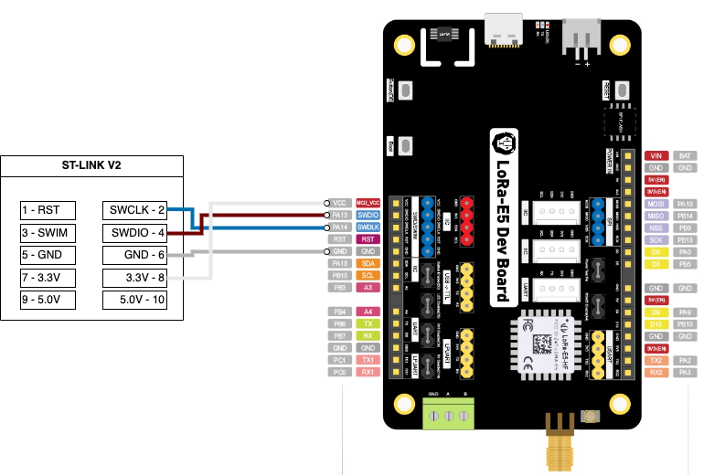

# LoRa - Hello World

This is my initial LoRa project. The goal is to program two LoRa devices with TinyGo and see if they can talk to each other.

## Hello World Program

Initialize a go module and grab the source code.

```sh
go mod init mymod
curl -o lora_rxtx.go https://raw.githubusercontent.com/tinygo-org/drivers/release/examples/sx126x/lora_rxtx/lora_rxtx.go
curl -o radio.go https://raw.githubusercontent.com/tinygo-org/drivers/release/examples/sx126x/lora_rxtx/radio.go
curl -o radio_stm32wl.go https://raw.githubusercontent.com/tinygo-org/drivers/release/examples/sx126x/lora_rxtx/radio_stm32wl.go
```

## Attach ST-Link V2

| ST-LINK Pin | LoRa-E5 Pin |
| ----------- | ----------- |
| 2 - SWCLK   | SWCLK       |
| 4 - SWDIO   | SWDIO       |
| 6 - GND     | GND         |
| 8 - 3.3V    | VCC         |



---

## Flashing

Programs are loaded onto the LoRa-E5 with an STLink hardware programmer, using the [openocd command line utility program](https://openocd.org/) to perform the board flashing. You must install OpenOCD before you will be able to flash the LoRa-E5 board with your TinyGo code. If this is a new LoRa-E5 board you will need to perform a one time task to unlock your board as described below.

* Install the *openocd* CLI on your workstation
* Connect the *ST-Link dongle* to the LoRa-E5 board
* Plug the *ST-Link dongle* into your workstation’s USB port
  * DO NOT plug in the LoRa-E5's USB cable at the same time
  * Press the **Boot** button on the LoRa-E5 board just before you plug it in. Keep it pressed for several seconds then let go
* Unlock your LoRa-E5 board using an *openocd* command
* Power cycle your LoRa-E5 by unplugging it from all power sources
* Plug the *ST-Link dongle* into your workstation’s USB port
* Build and flash your TinyGo program
* Unplug your *ST-Link dongle* from your workstation's USB port
* Plug in the LoRa-E5's USB cable to your workstation’s to view your program's log messages

The detaild commands for this process is described below.

```sh
# Install openocd
brew install openocd

# Connect components: LoRa-E5 <---> ST-LINK <---> Workstation
# Press Boot button just before you apply power, hold for a few seconds 
# Unlock your LoRa-E5 board by sending the openocd command below
# If it has trouble connecting try sending the openocd command what still holding the boot button 
openocd -f /usr/local/Cellar/open-ocd/0.12.0/share/openocd/scripts/interface/stlink.cfg  \
        -f /usr/local/Cellar/open-ocd/0.12.0/share/openocd/scripts/target/stm32wlx.cfg \
        -c init \
        -c "reset halt" \
        -c "stm32wlx unlock 0" \
        -c "reset run" \
        -c shutdown

# Power cycle your your LoRa-E5 board then...
# Connect components: LoRa-E5 <---> ST-LINK <---> Workstation
# Build and flash your TinyGo program 
tinygo flash -target=lorae5

# Run and debug your app
# Connect components: LoRa-E5 <---usb---> Workstation
```

---

## TinyGo Reference

* [Seeed Studio LoRa-E5 Development Kit](https://tinygo.org/docs/reference/microcontrollers/lorae5/)
* [lorae5 machine package](https://tinygo.org/docs/reference/microcontrollers/machine/lorae5/)
